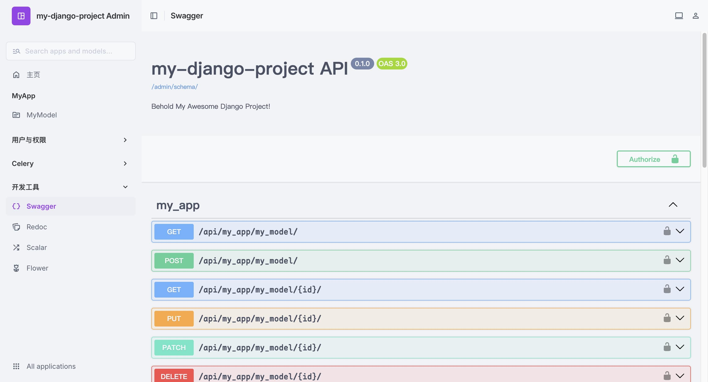

# ClanEver DRF Template

一个简单的 drf 模板，面向场景为企业内部服务 API，跳过新建项目和集成等琐碎步骤。

## 魔改

- 接口仅允许 OIDC 登录，客户端依赖 [Authlib]()
- Admin 使用 [Unfold Admin](https://github.com/unfoldadmin/django-unfold)
- 日志使用 [django-structlog](https://github.com/jrobichaud/django-structlog)
- 日志写入类使用 [utils/log.py](https://github.com/ClanEver/clanever-drf-template/blob/main/%7B%7B%20cookiecutter.project_dir%20%7D%7D/utils/log.py).SharedThreadedTimeRotatingHandler (因为 Python 自带的并非多进程安全)
- 接口文档 (Swagger, Redoc, Scalar) 和 Celery Flower 以 iframe 方式集成到 Admin



## 集成

- [celery](https://github.com/celery/celery) [[文档](https://docs.celeryq.dev/en/stable/) | [文档 With Django](https://docs.celeryq.dev/en/stable/django/index.html)]
    - [django-celery-beat](https://github.com/celery/django-celery-beat)
    - [django-celery-results](https://github.com/celery/django-celery-results)
    - [flower](https://github.com/mher/flower) [[文档](https://flower.readthedocs.io/en/latest/)]
- [django-debug-toolbar](https://github.com/django-commons/django-debug-toolbar) [[文档](https://django-debug-toolbar.readthedocs.io/en/latest/index.html)]
- [django-import-export](https://github.com/django-import-export/django-import-export) [[文档](https://django-import-export.readthedocs.io/en/latest/)]
- [django-structlog](https://github.com/jrobichaud/django-structlog) [[文档](https://django-structlog.readthedocs.io/en/latest/)]
    - [structlog](https://github.com/hynek/structlog) [[文档](https://www.structlog.org/en/stable/)]
- [django-rest-framework](https://github.com/encode/django-rest-framework/tree/master) [[文档](https://www.django-rest-framework.org/)]
    - [django-rest-knox](https://github.com/jazzband/django-rest-knox) [[文档](https://jazzband.github.io/django-rest-knox/)]
- [drf-spectacular](https://github.com/tfranzel/drf-spectacular) [[文档](https://drf-spectacular.readthedocs.io/en/latest/)]
- [django-unfold](https://github.com/unfoldadmin/django-unfold) [[文档](https://unfoldadmin.com/docs/)]

## 工具库

- [arrow](https://github.com/arrow-py/arrow) [[文档](https://arrow.readthedocs.io/en/latest/)]
- [more-itertools](https://github.com/more-itertools/more-itertools) [[文档](https://more-itertools.readthedocs.io/en/latest/)]
- [msgspec](https://github.com/jcrist/msgspec) [[文档](https://jcristharif.com/msgspec/)]
- [httpx](https://github.com/encode/httpx/) [[文档](https://www.python-httpx.org/)]
- [tenacity](https://github.com/jd/tenacity) [[文档](https://tenacity.readthedocs.io/en/latest/)]

## 使用方法

1. 安装 [uv](https://github.com/mitsuhiko/rye) 和 [mise](https://github.com/jdx/mise)

2. 使用 uv 安装 cookiecutter
    ```shell
    uv tool install cookiecutter --with jinja2-strcase --with tomlkit
    ```

3. 使用此模板
    ```shell
    cookiecutter https://github.com/ClanEver/clanever-drf-template.git
    ```

4. 更改 settings.py 然后在开发环境中运行
    ```shell
    # 创建迁移并应用迁移
    mise run dev_mnm
    # 运行服务器
    mise run dev
    ```

5. [可选] 使用应用模板
    ```shell
    mise run startapp
    # 或
    cookiecutter https://github.com/ClanEver/clanever-drf-app-template.git
    ```

## 相关

[clanever-drf-app-template](https://github.com/ClanEver/clanever-drf-app-template/)

## 许可证

[MIT](./LICENSE)
